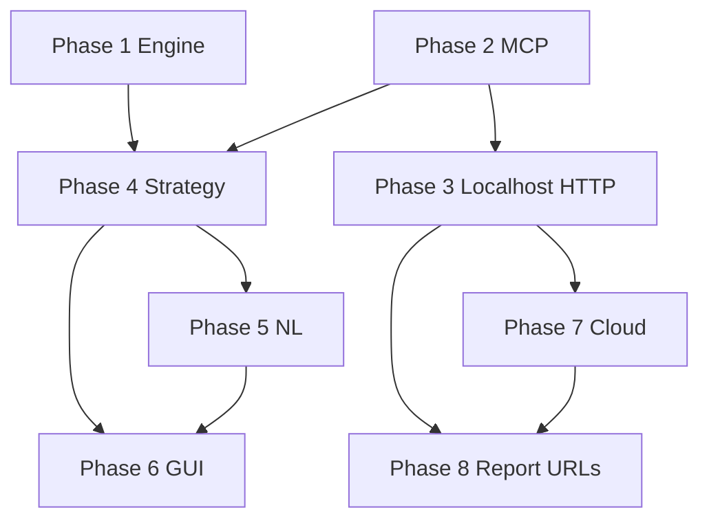

# FIXES — Cop–Thief MCP Assignment Gap Analysis & Phased Repair Plan

| Field | Value |
|-------|-------|
| Document | Actionable fix backlog derived from codebase audit vs assignment PRD |
| Project | `marl-cop-thief` — HW6 Dual AI Agent Cop–Thief Chase via MCP Servers |
| Source of truth | `docs/PRD.md`, `docs/PRD_game_engine.md`, `docs/PRD_nl_protocol.md`, `docs/TODO.md` |
| Audit date | 2026-06-24 |
| Constraint | Each phase below is sized for **one agent prompt** — do not combine phases in a single run |

> **New agent?** Read this entire **Project context** section before touching code. Every phase prompt at the bottom of each section assumes you have read it.

---

# Project context for new agents (read this first)

This section is the onboarding brief for any agent (or human) joining the repo cold. It explains **what the assignment is**, **how the system is shaped**, **what already works**, and **what FIXES.md is for**.

---

## 1. What this assignment is

**Course:** Multi-Agent Reinforcement Learning (UOH) — **HW6: Dual AI Agent Cop–Thief Chase via MCP Servers**

**Package name:** `marl-cop-thief` (Python ≥ 3.11, managed with **`uv` only** — no `pip`, no `venv`, no `python -m` for running the app)

**One-sentence summary:** Two autonomous AI agents — a **Cop** and a **Thief** — play a turn-based chase on a 2D grid. They **talk in natural language** (no raw coordinates), act through **two separate MCP servers**, and an **orchestrator** runs **6 sub-games** end-to-end then emails a **JSON-only report**.

**What graders care about (in order):**
1. Full autonomous pipeline — one command, zero manual steps during a run
2. Two independent MCP servers (local + cloud) with token auth
3. Natural-language inter-agent communication through MCP `send_message` / `receive_message`
4. Orchestration quality (turn loop, failure retry, Gatekeeper, config-driven everything)
5. JSON email report after exactly **6 valid** sub-games
6. GUI that shows the game state
7. Strategy optimality is **not** the main grade — heuristics are fine

**Formal model:** Dec-POMDP — two agents, partial observability (each sees own position + opponent NL message, not exact opponent coords). Documented in `README.md` §1 and `docs/PRD.md` §6.

---

## 2. Game rules (what the engine enforces)

| Rule | Value (default) | Notes |
|------|-----------------|-------|
| Grid | 5×5 (configurable) | `config.grid_size: [rows, cols]` |
| Agents | Cop + Thief | Start at random distinct cells per sub-game |
| Turn order | Thief moves first each round | `config.thief_moves_first: true` |
| Moves per sub-game cap | 25 rounds | Thief wins by **escape** if cop doesn't catch by then |
| Win: cop | Land on same cell as thief | Capture |
| Win: thief | Survive 25 rounds OR capture? | Escape at max moves |
| Cop special action | `place_barrier` | Blocks a cell for rest of sub-game; budget **5** per sub-game (`config.max_barriers`) |
| Movement | 8 directions + `stay` | Diagonals included; OOB and barrier cells rejected |
| Full game | **6 valid sub-games** | Invalid/technical-failure sub-games are **rerun** until 6 count |
| Scoring | Config table | e.g. cop win +20, thief win +10, etc. |

**Barriers are real** — implemented in `services/engine/rules.py` and exposed via cop MCP `place_barrier`. The GUI often **hides** them visually when the cop stands on the barrier cell; that is a display bug, not a missing feature.

**NL rule:** Agents must not send literal coordinates like `"I am at (2,3)"`. The `services/nlp/encoder.py` sanitizes outbound messages; `parser.py` + `estimator.py` interpret inbound cues.

---

## 3. System architecture

```
┌─────────────────────────────────────────────────────────────────┐
│  User interfaces                                                │
│  • CLI:  uv run cop-thief          (full 6-game autonomous run) │
│  • GUI:  uv run cop-thief-gui      (currently replay-heavy)     │
│  • Verify: uv run cop-thief-verify-cloud                         │
└────────────────────────────┬────────────────────────────────────┘
                             │ CopThiefSDK (public API only for GUI)
                             ▼
┌─────────────────────────────────────────────────────────────────┐
│  Orchestrator (MCP client) — services/orchestrator/             │
│  GameLoop → TurnController → Strategy → LlmClient               │
│  McpClient → Gatekeeper → HTTP SSE or DirectMcpBackend          │
│  OpponentEstimator, ActionValidator, TranscriptLogger           │
└────────────┬───────────────────────────────┬────────────────────┘
             │                               │
             ▼                               ▼
┌────────────────────────┐    ┌──────────────────────────────────┐
│  Game engine (pure)    │    │  MCP servers (tools only, no LLM) │
│  services/engine/      │    │  mcp_servers/cop_server.py :8001  │
│  board, rules, scoring │◄───│  mcp_servers/thief_server.py:8002│
│  lifecycle             │    │  (+ state_server for cloud)       │
└────────────────────────┘    └──────────────────────────────────┘
             │
             ▼
┌────────────────────────┐    ┌──────────────────────────────────┐
│  Strategy              │    │  LLM (OpenAI-compatible API)      │
│  heuristic | qlearning │    │  OpenRouter via LLM_API_KEY in .env│
│  | llm                 │    │  config.llm.provider/model/base_url│
└────────────────────────┘    └──────────────────────────────────┘
                             │
                             ▼
┌─────────────────────────────────────────────────────────────────┐
│  Report — services/report/ → Gmail API (JSON body only)         │
│  Triggered automatically at end of run_full_game()              │
└─────────────────────────────────────────────────────────────────┘
```

**Critical separation (FR-MCP2):** MCP servers expose **tools only**. The LLM lives in the **orchestrator**, not inside the servers. Strategies decide actions; the orchestrator calls MCP `apply_action`.

**Default local wiring:** For `localhost` URLs in config, the SDK uses **DirectMcpBackend** (in-process tool calls, no HTTP). This lets `uv run cop-thief` work with zero manual server startup. True HTTP to ports 8001/8002 requires explicit config (Phase 3 fix).

---

## 4. One turn of play (orchestrator workflow)

For each agent turn (`TurnController.execute_turn`):

1. **Load context** — `verify_position`, `receive_message` via MCP
2. **Estimate opponent** — `OpponentEstimator` fuses NL cues + move history (partial observability)
3. **Decide action** — `Strategy.decide()` (heuristic / Q-learning / LLM)
4. **Validate** — `ActionValidator`; heuristic fallback if illegal
5. **Encode NL message** — `encode_message()` (coordinate-free, tone from config)
6. **Send** — MCP `send_message`
7. **Apply** — MCP `apply_action` (or `place_barrier` on cop server)
8. **Record** — transcript JSONL + GUI snapshot frame

**Known bug (fix in Phase 4):** `_load_context()` currently passes `barriers=frozenset()` and `barriers_used=0` to strategies — agents plan as if no barriers exist even though MCP enforces them.

---

## 5. MCP tool surface

There is **no `move` tool** — movement is `apply_action(agent, action)` where action is `up`, `down`, `left`, `right`, diagonals, `stay`, or `place_barrier` (cop).

| Tool | Cop server | Thief server | Called by orchestrator? |
|------|------------|--------------|------------------------|
| `send_message` | ✅ | ✅ | ✅ every turn |
| `receive_message` | ✅ | ✅ | ✅ every turn |
| `verify_position` | ✅ | ✅ | ✅ |
| `update_position` | ✅ | ✅ | ✅ sub-game reset |
| `apply_action` | ✅ | ✅ | ✅ |
| `place_barrier` | ✅ | ❌ | ✅ (cop) |
| `game_status` | ✅ | ✅ | ✅ |
| `choose_action` | ✅ | ✅ | ❌ (strategy is client-side) |

**Auth:** Bearer tokens `MCP_COP_TOKEN` / `MCP_THIEF_TOKEN` in `.env`. Unauthenticated calls must be rejected.

---

## 6. Configuration and secrets

| Kind | Location | Examples |
|------|----------|----------|
| Tunables | `config/config.yaml` | `grid_size`, `max_moves`, `num_games`, `strategy`, `llm`, `mcp` URLs, `scoring`, `report` identity |
| Cloud config | `config/config.cloud.yaml` | HTTPS MCP URLs (placeholders until deploy) |
| Secrets | `.env` (gitignored) | `LLM_API_KEY`, `MCP_*_TOKEN`, `GMAIL_ACCESS_TOKEN` |
| Env override | `CONFIG_PATH` | Point to cloud yaml |

**LLM (OpenRouter):** Set `LLM_API_KEY` in `.env` and in `config.yaml`:
```yaml
llm:
  provider: openai
  model: openai/gpt-4o-mini
  base_url: https://openrouter.ai/api/v1
strategy: heuristic   # or llm | qlearning
```

**Report identity** (must finalize before submission):
```yaml
report:
  group_name: "TBD"          # ← still placeholder
  students: ["Mohamed", "Saed"]
  github_repo: "https://github.com/..."
```

---

## 7. Repository map (where code lives)

| Path | Responsibility |
|------|----------------|
| `src/cop_thief/services/engine/` | Pure game rules — board, moves, barriers, scoring, lifecycle |
| `src/cop_thief/mcp_servers/` | FastMCP cop/thief/state servers + tool implementations |
| `src/cop_thief/services/orchestrator/` | Turn loop, MCP client, LLM client, estimator, validator |
| `src/cop_thief/services/strategy/` | Heuristic, Q-learning stub, LLM strategy, factory |
| `src/cop_thief/services/nlp/` | Encoder, parser, transcript JSONL writer |
| `src/cop_thief/services/report/` | JSON report builder + Gmail sender |
| `src/cop_thief/services/deployment/` | Cloud URL detection, verify-cloud logic |
| `src/cop_thief/sdk/facade.py` | **CopThiefSDK** — only entry point for GUI |
| `src/cop_thief/gui/` | Tkinter app (presentation layer) |
| `src/cop_thief/cli/` | `cop-thief`, `cop-thief-verify-cloud` entry points |
| `src/cop_thief/shared/` | Config loader, Gatekeeper, auth, logging |
| `config/` | YAML runtime config |
| `tests/unit/`, `tests/integration/` | pytest; coverage gate **≥ 85%** |
| `deploy/` | Render blueprint, Docker |
| `docs/PRD.md` | Requirements source of truth |
| `docs/TODO.md` | Phased task checklist (P0–P9) |
| `results/` | NL transcript JSONL files per run |

---

## 8. CLI entry points

```powershell
uv sync --all-extras              # install deps
uv run cop-thief                  # full 6 sub-games + email attempt (main submission path)
uv run cop-thief-gui              # Tkinter visualizer (incomplete UX — see Phase 6)
uv run python -m cop_thief.mcp_servers.cop_server    # manual cop MCP :8001
uv run python -m cop_thief.mcp_servers.thief_server  # manual thief MCP :8002
uv run cop-thief-verify-cloud     # test deployed cloud MCP endpoints
uv run pytest tests/              # full test suite
uv run ruff check .               # lint (must be 0 violations)
```

---

## 9. What is already done vs what FIXES.md addresses

**Substantially complete today (do not rebuild from scratch):**
- Game engine (grid, movement, capture, escape, barriers, scoring, 6-game loop)
- Two FastMCP servers + token auth + tool suite
- Orchestrator turn pipeline + NL encoder/parser + JSONL transcripts
- CLI autonomous full game (`uv run cop-thief`)
- Heuristic + LLM strategies; thin Q-learning stub
- JSON report builder + Gmail sender (needs real OAuth token to send)
- Docker/Render deploy artifacts + verify-cloud CLI
- Unit/integration tests with 85% coverage gate

**What FIXES.md phases actually repair:**
| Phase | Real work remaining |
|-------|---------------------|
| 1 | Edge-case barrier rules, duplicate placement bug, extra tests |
| 2 | `game_status` barrier fields, docs, Gatekeeper consistency |
| 3 | Config flag to force HTTP localhost MCP (optional for grading) |
| 4 | **Critical:** feed barrier map into strategy observations |
| 5 | NL prompt hygiene, transcript metadata |
| 6 | **Major:** GUI live play, full 6-game button, barrier display, NL panel |
| 7 | Operational: deploy to Render, set real HTTPS URLs |
| 8 | Operational: Gmail token, finalize `group_name`, submission run |

**~10–12 items are must-fix; the rest is polish, optional Q-learning, or one-time ops.**

---

## 10. Engineering constraints (do not violate)

- **Tooling:** `uv run` only for execute/test/lint
- **Secrets:** never in config YAML or Git; `.env` only
- **Module size:** ~150 LOC per file target (split if growing)
- **GUI rule (FR-G3):** `gui/` imports **only** `CopThiefSDK` — no direct engine/orchestrator imports
- **Gatekeeper:** external calls (LLM, Gmail, HTTP MCP) should route through `shared/gatekeeper.py`
- **Quality gates:** `ruff check .` = 0 violations; `pytest` coverage ≥ 85%
- **Commits:** only when the user explicitly asks

---

## 11. Key documents (read before large changes)

| Doc | When to read |
|-----|--------------|
| `docs/PRD.md` | Requirements, FR-* IDs, acceptance criteria |
| `docs/PRD_game_engine.md` | Barrier rules, movement, scoring detail |
| `docs/PRD_nl_protocol.md` | Coordinate-free messaging contract |
| `docs/PLAN.md` | Architecture, directory tree |
| `docs/DEPLOYMENT.md` | Cloud deploy steps |
| `docs/TODO.md` | Task IDs tied to phases |
| `README.md` | Install, usage, Dec-POMDP summary |
| `HOW_TO_USE_AND_CHALLENGE.md` | API keys, cloud env, bonus matches |
| **This file (`FIXES.md`)** | Gap analysis + phased repair prompts |

---

## 12. How to use FIXES.md in a new agent chat

1. **Read §1–11 above** (project context) — you are here.
2. **Read the Executive summary** below — why the GUI felt broken.
3. **Execute exactly one Phase** (1–8) per chat — copy that phase's **Agent prompt** block.
4. **Do not combine phases** — each is sized to avoid context overload.
5. **Run that phase's Verification commands** before marking done.
6. **Update FIXES.md** checkboxes if the user wants progress tracking.

**Standard opening line for any phase prompt:**
```text
You are working on the marl-cop-thief HW6 assignment (Cop–Thief chase via MCP).
Read FIXES.md "Project context for new agents" and the assigned Phase section.
Execute only that phase. Use uv for all commands. Do not commit unless asked.
```

---

## Executive summary (why the GUI felt “absolutely incomplete”)

The **game engine, MCP servers, orchestrator, NL pipeline, and CLI full-game path are largely implemented**. What you experienced in the GUI is real: the Tkinter app is a **single-sub-game replay viewer**, not a live match monitor.

Concrete symptoms you likely saw:

| Symptom | Root cause |
|---------|------------|
| No barriers visible before clicking **Run** | Initial `GameState` has empty `barriers`; board is a placeholder at `(0,0)` for both agents |
| Barriers seem “missing” during cop placement | `place_barrier` **is implemented** in the engine and MCP, but the GUI draws the cop **on top of** the barrier cell — the `"B"` label is overwritten by `"C"` |
| Board frozen while **Run** executes | GUI runs the sub-game on a background thread and only loads frames **after** completion — no live turn updates |
| Only one sub-game | GUI calls `sdk.run_sub_game()` only; **`run_full_game()` (6 games) exists in the SDK but has no GUI button** |
| NL panel shows one line | Only `latest_message` from the current replay frame — no scrolling transcript, no cop/thief labels |
| No barrier budget (e.g. 2/5) | `barriers_used` exists in replay snapshots but is never shown in the side panel |

**Bottom line:** barriers and most game mechanics exist in the backend; the GUI does not adequately surface them, and several cross-layer bugs (especially barrier-blind strategy context) degrade behavior even when the CLI runs.

---

## How to use this document

See **§12 How to use FIXES.md in a new agent chat** in the Project context section above.

Quick recap:
1. Execute phases **in order** (1 → 8) unless the user directs otherwise.
2. Copy the **Agent prompt** block at the end of the chosen phase.
3. Run that phase’s **Verification** commands before proceeding.
4. Mark items `[x]` in the phase checklist as they are completed.

### Status legend

- ✅ **Done** — implemented and tested in repo today
- ⚠️ **Partial** — exists but buggy, incomplete UX, or not wired end-to-end
- ❌ **Missing** — not implemented or not operational

---

## Phase overview

| Phase | Core activity | Overall status | Biggest gap |
|-------|---------------|----------------|-------------|
| 1 | Game Engine Logic | ✅ Mostly done | PRD barrier-on-agent invariant; duplicate placement bug |
| 2 | MCP Communication Infrastructure | ✅ Mostly done | `choose_action` on server unused by orchestrator |
| 3 | Localhost Verification | ⚠️ Partial | Default CLI bypasses live HTTP MCP on ports 8001/8002 |
| 4 | Strategy Development | ⚠️ Partial | Strategies blind to live barrier map; Q-learning is a thin stub |
| 5 | Natural Language Integration | ⚠️ Partial | Works in orchestrator; not surfaced in GUI; barrier context gap |
| 6 | GUI Visualization | ❌ User-facing gap | Replay-only, 1 sub-game, no live play — **primary complaint** |
| 7 | Production Cloud Deployment | ⚠️ Artifacts only | Live HTTPS URLs not configured; operational deploy pending |
| 8 | Automated Reporting Completion | ⚠️ Code done | Gmail OAuth not set up; `group_name` still `"TBD"`; app-password path missing |

---

# Phase 1 — Game Engine Logic

**Functional target:** Grid boundaries, movement validations, catch definitions, barrier rules.

### Current state ✅

| Requirement | Status | Evidence |
|-------------|--------|----------|
| N×M grid from config | ✅ | `services/engine/board.py`, `config/config.yaml` |
| 8-direction movement + `stay` | ✅ | `constants.py` `MOVE_DELTAS`, `COP_ACTIONS`, `THIEF_ACTIONS` |
| OOB rejection | ✅ | `services/engine/rules.py` `_handle_movement` |
| Capture = same cell | ✅ | `rules.py` `check_terminal`, immediate win on move |
| Thief escape at `max_moves` | ✅ | `rules.py` `check_terminal` |
| Cop `place_barrier` with budget | ✅ | `rules.py` `_handle_place_barrier`, `board.py` |
| Thief cannot place barriers | ✅ | Agent guard in `rules.py` + thief MCP server |
| Move into barrier rejected | ✅ | `rules.py`, `test_rules_barriers.py` |
| Scoring table | ✅ | `services/engine/scoring.py` |
| 6 valid sub-games with retry | ✅ | `services/engine/lifecycle.py`, `orchestrator/game_loop.py` |
| Unit tests | ✅ | `tests/unit/test_rules_*`, `test_board_*`, `test_scoring.py`, `test_lifecycle.py` |

### Fixes required

#### P1-F01 — Enforce “agents cannot occupy barrier cells” (PRD §2.2) ⚠️

**Problem:** `PRD_game_engine.md` §2.2 states neither agent may occupy a barrier cell. The engine allows the cop to **remain on the cell** after `place_barrier` (cop does not move, cell becomes blocked). This contradicts the PRD invariant and causes GUI confusion (cop hides barrier).

**Files:** `services/engine/rules.py`, `services/engine/board.py`, `docs/PRD_game_engine.md` (reconcile §2.2 vs §5.1 if intentional exception)

**Fix options (pick one and document):**
- **Option A:** After placement, cop is pushed to nearest legal adjacent cell (if any).
- **Option B:** Placement targets an **adjacent** cell instead of current cell (PRD §5.1 may need update).
- **Option C:** Allow cop-on-barrier as a documented exception; fix GUI to show barrier under/over cop distinctly.

**Tests to add:** `tests/unit/test_rules_barriers.py` — cop position after `place_barrier`.

#### P1-F02 — Reject duplicate `place_barrier` on same cell ⚠️

**Problem:** `Board.place_barrier` increments `barriers_used` even when the cell is already in the set. Cop can waste budget.

**Files:** `services/engine/board.py`, `services/engine/rules.py`

**Tests:** `test_rules_barriers.py` — second placement on same cell returns `legal=False`, budget unchanged.

#### P1-F03 — Add missing unit test coverage (P2) ⚠️

| Test | File |
|------|------|
| Thief directional moves (mirror cop parametrized tests) | `tests/unit/test_rules_moves.py` |
| `run_full_game` produces exactly 6 valid sub-games | `tests/unit/test_lifecycle.py` |
| Illegal move turn still advances (documented behavior) | `tests/unit/test_lifecycle.py` or orchestrator test |
| Scoring bounds documentation (6 games → cop max 90, thief max 60) | `tests/unit/test_scoring.py` comment or assertion |

#### P1-F04 — Clarify engine vs MCP authority for barriers (docs only) ⚠️

**Problem:** Engine is authoritative (`FR-O1`), but MCP `_tools_impl.py` also mutates state. Ensure barrier placement path is single-source-of-truth and documented.

**Files:** `mcp_servers/_tools_impl.py`, `services/engine/rules.py`

### Phase 1 verification

```powershell
uv run pytest tests/unit/test_rules_moves.py tests/unit/test_rules_barriers.py tests/unit/test_rules_victory.py tests/unit/test_board_core.py tests/unit/test_scoring.py tests/unit/test_lifecycle.py -v
uv run ruff check src/cop_thief/services/engine
```

### Phase 1 agent prompt

```text
You are working on the marl-cop-thief HW6 assignment (Cop–Thief chase via MCP).
Read FIXES.md "Project context for new agents" (§1–11) and Phase 1 only.
Use uv for all commands. Do not commit unless asked.

Execute FIXES.md Phase 1 only (Game Engine Logic).

Fix P1-F01 through P1-F04:
- Resolve cop-on-barrier-cell behavior per PRD_game_engine.md (pick Option A, B, or C and document in code comment + PRD if needed).
- Prevent duplicate place_barrier from consuming budget.
- Add the missing unit tests listed in Phase 1.
- Ensure barrier placement has a single authoritative code path.

Do not modify GUI, MCP servers, cloud deploy, or reporting in this phase.
Run Phase 1 verification commands and ensure all tests pass.
```

---

# Phase 2 — MCP Communication Infrastructure

**Functional target:** Stand up independent FastMCP server shells.

### Current state ✅

| Requirement | Status | Evidence |
|-------------|--------|----------|
| Independent cop MCP server | ✅ | `mcp_servers/cop_server.py` — FastMCP, SSE, port from config |
| Independent thief MCP server | ✅ | `mcp_servers/thief_server.py` |
| Tools: `send_message`, `receive_message` | ✅ | Both servers |
| Tools: `verify_position`, `update_position` | ✅ | Both servers |
| Tools: `apply_action` (moves) | ✅ | Both servers — **no separate `move` tool** (by design) |
| Tool: `place_barrier` (cop only) | ✅ | `cop_server.py` `place_barrier()` |
| Tool: `game_status` | ✅ | Both servers |
| Tool: `choose_action` | ✅ on server | ⚠️ orchestrator never calls it — strategy runs in client |
| Token auth on every tool | ✅ | `_tools_impl.py` `authorize()`, `shared/auth.py` |
| Token revocation at startup | ✅ | `runtime.py` `MCP_REVOKED_TOKENS` |
| Shared state for multi-process | ✅ | `data/mcp_state.json` + `_state_backend.py`; cloud `state_server.py` |
| Cloud generic entrypoint | ✅ | `mcp_servers/server.py`, `cop-thief-mcp` CLI |

### Fixes required

#### P2-F01 — Document tool contract vs orchestrator responsibilities ⚠️

**Problem:** PRD `FR-MCP3` lists `choose_action` and “communicate with game engine.” The orchestrator decides actions locally (heuristic/LLM/Q-learning) and only calls `apply_action`. This is valid architecture but should be explicit in README so graders don’t assume the server runs the LLM.

**Files:** `README.md`, `docs/PRD.md` or `docs/PLAN.md` architecture section

#### P2-F02 — Ensure `game_status` returns barrier map for client ⚠️

**Problem:** `TurnController._load_context()` hardcodes `barriers=frozenset()` — likely because `game_status` response is incomplete or not parsed. Verify MCP `game_status` exposes `barriers` and `barriers_used`.

**Files:** `mcp_servers/_tools_impl.py`, `mcp_servers/_state.py`, `orchestrator/mcp_client.py`

**Fix:** Add/confirm `barriers: list[list[int]]` and `barriers_used: int` in `game_status` response schema.

#### P2-F03 — Gatekeeper bypass in direct MCP mode ⚠️

**Problem:** `McpClient` skips Gatekeeper when using `DirectMcpBackend` (in-process). Acceptable for local dev but inconsistent with NFR-5 “all external calls through Gatekeeper.”

**Files:** `orchestrator/mcp_client.py`, `orchestrator/_mcp_direct.py`

**Fix:** Route direct calls through Gatekeeper with target `"mcp-direct"` OR document as intentional local optimization.

#### P2-F04 — Integration test: `place_barrier` over live SSE ⚠️

**Status:** Partially covered in `tests/integration/test_mcp_servers.py`. Add explicit assertion that barrier appears in `game_status` after cop `place_barrier`.

### Phase 2 verification

```powershell
uv run pytest tests/unit/test_mcp_tools.py tests/unit/test_mcp_auth.py tests/integration/test_mcp_servers.py -v
# Manual smoke (two terminals):
# uv run python -m cop_thief.mcp_servers.cop_server
# uv run python -m cop_thief.mcp_servers.thief_server
```

### Phase 2 agent prompt

```text
You are working on the marl-cop-thief HW6 assignment (Cop–Thief chase via MCP).
Read FIXES.md "Project context for new agents" (§1–11) and Phase 2 only.
Use uv for all commands. Do not commit unless asked.

Execute FIXES.md Phase 2 only (MCP Communication Infrastructure).

Fix P2-F01 through P2-F04:
- Ensure game_status returns barriers and barriers_used; update MCP tool impl and tests.
- Document that choose_action exists on servers but orchestrator uses client-side strategy (README architecture).
- Decide Gatekeeper policy for direct MCP (wire through or document exception).
- Add integration test asserting place_barrier updates game_status.

Do not change GUI or cloud deploy. Run Phase 2 verification.
```

---

# Phase 3 — Localhost Verification

**Functional target:** Connect both MCP servers to the client orchestrator locally.

### Current state ⚠️

| Requirement | Status | Evidence |
|-------------|--------|----------|
| HTTP/SSE client to MCP | ✅ | `orchestrator/_mcp_transport.py` |
| `McpServerLauncher` spawns both servers | ✅ | `orchestrator/_mcp_launcher.py` |
| CLI one-command full game | ✅ | `uv run cop-thief` — **uses in-process DirectMcpBackend** |
| HTTP localhost E2E | ⚠️ | Works only with `use_direct_mcp=False` + servers running |
| Auto-launch on localhost | ❌ | `resolve_mcp_wiring()` returns `(direct=True, auto_launch=False)` always for localhost |
| Full 6-game integration over HTTP localhost | ❌ | `test_orchestrator.py` / `test_full_pipeline.py` use direct MCP only |

### Fixes required

#### P3-F01 — Add config flag for MCP wiring mode ❌

**Problem:** No user-facing way to force “real HTTP localhost” vs “direct in-process” without code changes.

**Files:** `config/config.yaml`, `shared/_config_schemas.py` (`McpConfig`), `services/deployment/cloud.py`

**Suggested config:**
```yaml
mcp:
  mode: direct   # direct | http | auto
  auto_launch: true   # when mode=http and URLs are localhost
```

**Behavior:**
- `direct` — current default (zero manual steps, good for dev)
- `http` — orchestrator connects to `cop_url`/`thief_url` over SSE; optionally auto-launch servers
- `auto` — direct for localhost, http for cloud (current logic, but explicit)

#### P3-F02 — Wire `auto_launch_servers=True` when `mcp.mode=http` and hosts are localhost ❌

**Files:** `deployment/cloud.py` `resolve_mcp_wiring()`, `sdk/facade.py`

**Fix:** When HTTP mode + localhost URLs, `McpServerLauncher` should start both servers before `run_full_game()`.

#### P3-F03 — CLI respects MCP mode ❌

**Files:** `cli/main.py`

**Fix:** `cop-thief` reads config mode; prints which MCP path is active at startup.

#### P3-F04 — Integration test: full 6-game loop over HTTP localhost ❌

**Files:** `tests/integration/test_orchestrator.py` (new test case)

**Pattern:** Use `McpServerLauncher` fixture + `CopThiefSDK(..., use_direct_mcp=False, auto_launch_servers=True)` + `num_games: 6`.

#### P3-F05 — README “Localhost HTTP verification” section ❌

Document the two modes:
1. **Quick path:** `uv run cop-thief` (direct MCP, no servers)
2. **Assignment verification path:** `mcp.mode: http` + tokens in `.env` + `uv run cop-thief`

### Phase 3 verification

```powershell
# After fixes — HTTP mode:
uv run cop-thief
# Expect log: connecting to http://localhost:8001 and :8002, servers auto-launched

uv run pytest tests/integration/test_orchestrator.py tests/integration/test_mcp_servers.py -v
```

### Phase 3 agent prompt

```text
You are working on the marl-cop-thief HW6 assignment (Cop–Thief chase via MCP).
Read FIXES.md "Project context for new agents" (§1–11) and Phase 3 only.
Use uv for all commands. Do not commit unless asked.

Execute FIXES.md Phase 3 only (Localhost Verification).

Implement P3-F01 through P3-F05:
- Add mcp.mode and mcp.auto_launch to config schema and config.yaml.
- Update resolve_mcp_wiring() and CopThiefSDK/CLI to honor HTTP localhost with optional auto-launch.
- Add integration test: 6-game full pipeline over live HTTP MCP (not direct).
- Update README with both quick (direct) and verification (HTTP) paths.

Do not modify GUI yet. Run Phase 3 verification.
```

---

# Phase 4 — Strategy Development

**Functional target:** Implement decision heuristics or initialize the Q-Table.

### Current state ⚠️

| Requirement | Status | Evidence |
|-------------|--------|----------|
| Heuristic Manhattan cop/thief | ✅ | `services/strategy/heuristic.py` |
| Cop barrier when adjacent + budget | ✅ | `heuristic.py` — **but sees empty barrier set** |
| Strategy factory `heuristic\|qlearning\|llm` | ✅ | `services/strategy/factory.py` |
| LLM strategy + fallback | ✅ | `services/strategy/llm_strategy.py`, `orchestrator/llm_client.py` |
| Q-learning (optional FR-D2) | ⚠️ Thin stub | `services/strategy/qlearning.py` — online only, no training/persistence |
| Opponent estimate in strategy | ✅ | `orchestrator/estimator.py` |
| Config `discount_gamma` for Q-learning | ⚠️ Partial | Q-learning reads it; `learning_rate`/`epsilon` hardcoded |

### Fixes required

#### P4-F01 — Feed live barrier state into strategy observations ❌ (critical)

**Problem:** `TurnController._load_context()` always passes:
```python
barriers=frozenset(),
barriers_used=0,
```
Heuristic barrier avoidance, Q-learning `_legal_actions`, and `ActionValidator` all run **as if no barriers exist**.

**Files:** `orchestrator/turn_controller.py`, `orchestrator/mcp_client.py`

**Fix:** Parse `game_status` (or dedicated MCP call) and pass real `barriers` / `barriers_used` into `Observation`.

**Tests:** `tests/unit/test_turn_controller.py` or integration — cop heuristic avoids known barrier cell.

#### P4-F02 — Heuristic `place_barrier` uses barrier map ⚠️

**Problem:** Cop places barrier when adjacent to **estimate**, but doesn’t avoid placing into existing barriers or wasting budget on duplicates (ties to P1-F02).

**Files:** `services/strategy/heuristic.py`

#### P4-F03 — Q-learning: config-driven hyperparameters ⚠️

**Files:** `config/config.yaml`, `_config_schemas.py`, `services/strategy/qlearning.py`, `factory.py`

**Add:**
```yaml
qlearning:
  learning_rate: 0.1
  epsilon: 0.1
  # discount uses discount_gamma
```

#### P4-F04 — Q-learning optional scope (pick one) ⚠️

| Task | Priority | Files |
|------|----------|-------|
| Write `docs/PRD_qlearning.md` | P3 if claiming Q-learning | new doc |
| State encoding includes barrier map hash or count | P3 | `qlearning.py` |
| Q-table save/load to `data/q_table.json` | P3 | `qlearning.py`, `factory.py` |
| Training script + learning curve plot in `assets/` | P3 | `notebooks/` or `cli/` |
| Unit test: Bellman update expected values | P3 | `tests/unit/test_strategy_qlearning.py` |

**Recommendation:** If submission uses `strategy: heuristic` or `strategy: llm`, P4-F04 can be deferred. Minimum for grading is P4-F01 + heuristic correctness.

#### P4-F05 — OpenRouter / LLM config documentation ⚠️

**Not a code bug** — ensure `config.yaml` documents OpenRouter:
```yaml
llm:
  provider: openai
  model: openai/gpt-4o-mini
  base_url: https://openrouter.ai/api/v1
```

### Phase 4 verification

```powershell
uv run pytest tests/unit/test_strategy_heuristic.py tests/unit/test_strategy_factory.py tests/unit/test_strategy_qlearning.py -v
# Manual: set strategy: heuristic, seed: 42, run cop-thief — cop should use barriers intelligently
```

### Phase 4 agent prompt

```text
Execute FIXES.md Phase 4 only (Strategy Development).

Priority: P4-F01 (barrier-aware observations in TurnController) — this is critical.

Then P4-F02, P4-F03, and document OpenRouter in config (P4-F05).
Only implement P4-F04 Q-learning extras if docs/TODO Q-learning tasks are in scope; otherwise add a note in FIXES.md that heuristic+llm path is sufficient.

Add tests proving strategies receive real barrier data from MCP game_status.
Run Phase 4 verification.
```

---

# Phase 5 — Natural Language Integration

**Functional target:** Wrap system operations in text prompts and text-processing parsing pipelines.

### Current state ⚠️

| Requirement | Status | Evidence |
|-------------|--------|----------|
| Free-text via MCP send/receive | ✅ | `turn_controller.py`, MCP tools |
| Coordinate-free outbound (encoder) | ✅ | `services/nlp/encoder.py` `sanitize_message` |
| Inbound parser + intent cues | ✅ | `services/nlp/parser.py` |
| Opponent estimator fusion | ✅ | `orchestrator/estimator.py` |
| Ambiguity handling | ✅ | Parser confidence; estimator unchanged on empty |
| JSONL transcripts per sub-game | ✅ | `services/nlp/transcript.py` → `results/nl_transcript_subgame_*.jsonl` |
| Configurable tone | ✅ | `config.nlp.tone` |
| LLM prompt + JSON parse | ✅ | `llm_client.py`, `_llm_parse.py` |
| Heuristic fallback on LLM failure | ✅ | `llm_client.py` |

### Fixes required

#### P5-F01 — Depends on P4-F01: NL-informed play needs barrier context ⚠️

Strategies and encoder use `Observation` — fixing barrier loading improves NL quality indirectly.

#### P5-F02 — LLM prompt leaks raw coordinates ⚠️

**Problem:** `LlmClient._build_prompt()` includes literal `own_pos` and `opp_estimate`. Internal use is OK, but increases risk of coordinate leakage in `nl_message`.

**Files:** `orchestrator/llm_client.py`

**Fix:** Prompt should say “your region is upper-left” instead of `(1,2)` OR add explicit instruction + post-parse `sanitize_message` on LLM output before MCP send (encoder already runs in turn_controller — verify order).

#### P5-F03 — Richer heuristic/Q-learning NL messages ⚠️

**Problem:** Heuristic returns generic `"Closing in."` / `"Slipping away."` which `encoder.py` treats as `_GENERIC` and may skip tone enrichment.

**Files:** `services/strategy/heuristic.py`, `services/nlp/encoder.py`

#### P5-F04 — Transcript metadata ⚠️

**Enhancement:** Add `turn`, `action`, `sub_game_index` to JSONL records (some fields exist — verify against PRD evidence needs).

**Files:** `services/nlp/transcript.py`, `tests/unit/test_nlp_encoder_parser.py`

#### P5-F05 — GUI does not show NL pipeline output ❌

Deferred to **Phase 6** but note: transcript files are written; GUI never reads them.

### Phase 5 verification

```powershell
uv run pytest tests/unit/test_nlp_encoder_parser.py tests/integration/test_orchestrator.py -v
uv run cop-thief
# Check results/nl_transcript_subgame_1.jsonl — messages must not contain raw (row,col) patterns
```

### Phase 5 agent prompt

```text
Execute FIXES.md Phase 5 only (Natural Language Integration).

Fix P5-F02 through P5-F04:
- Reduce coordinate leakage in LLM prompts; ensure encoder sanitizes all outbound MCP messages.
- Improve heuristic NL messages so encoder can apply tone/region phrasing.
- Verify transcript JSONL schema has turn, agent, action, text per line.

Assume P4-F01 (barrier context) is already done.
Do not rebuild GUI yet. Run Phase 5 verification.
```

---

# Phase 6 — GUI Visualization

**Functional target:** Create a visual frontend monitor to watch agent matches live.

### Current state ❌ (relative to assignment intent)

| PRD requirement | Status | Gap |
|-----------------|--------|-----|
| FR-G1 grid, cop, thief, barriers | ⚠️ | Barriers only in replay; cop hides barrier cell; initial state wrong |
| FR-G2 movement over time + scores | ⚠️ | Post-hoc replay only, not live; no multi-sub-game scores |
| FR-G3 SDK-only presentation | ✅ | `gui/app.py` imports only `CopThiefSDK` |

### What exists today

- Buttons: **Run** (1 sub-game), **Play**, **Step**, **Capture**
- Canvas drawing via `view_model.py` + `drawing.py`
- Replay frames from `sdk.get_replay_frames()` after sub-game completes
- Latest NL message only (single `Text` widget)

### Fixes required

#### P6-F01 — SDK: live frame callback during sub-game execution ❌

**Problem:** `GameLoop._append_snapshot()` builds frames internally but GUI only reads them after `run_sub_game()` returns.

**Files:** `orchestrator/game_loop.py`, `sdk/facade.py`, `sdk/_facade_types.py`

**Fix:** Add optional `on_frame: Callable[[GameState], None]` to `run_sub_game()` / `run_full_game()`; GUI registers callback via `root.after()` for thread-safe updates.

#### P6-F02 — GUI: **Run Full Game** (6 sub-games) button ❌

**Files:** `gui/app.py`

**Fix:** Call `sdk.run_full_game()` on background thread; show cumulative scores; advance sub-game indicator 1→6.

#### P6-F03 — GUI: live board updates during autonomous play ❌

**Depends on:** P6-F01

**UX:** Board animates each turn; status shows active agent (Cop/Thief), round N/25, barriers_used N/5.

#### P6-F04 — Fix barrier rendering ⚠️

**Files:** `gui/view_model.py`

**Fixes:**
- When cop stands on barrier cell, show **both** indicators (e.g. split cell, border hatch, or `C+B` label).
- Show `barriers_used / max_barriers` in status panel.

#### P6-F05 — Fix initial / idle board state ⚠️

**Problem:** `get_state()` returns default `(0,0)` for both agents — overlapping at corner.

**Files:** `sdk/facade.py`, `gui/app.py`

**Fix:** On GUI launch, call `sdk.health_check()` and/or `_refresh_state()`; show empty board with “Press Run” instead of fake positions.

#### P6-F06 — NL transcript panel ❌

**Files:** `gui/app.py`

**Fix:** Scrolling `Text` or `Listbox` showing timestamped cop/thief messages from replay frames OR load `results/nl_transcript_subgame_*.jsonl` after run.

#### P6-F07 — Playback controls ⚠️

**Add:** Pause, Stop, Rewind to frame 0, speed slider (Play interval currently hardcoded 420ms in `app.py`).

#### P6-F08 — Capture exports PNG not just PostScript ⚠️

**Problem:** `Capture` saves `.ps` — awkward for README evidence.

**Files:** `gui/app.py`

**Fix:** Use `PIL.ImageGrab` or `canvas.postscript` + convert; save `assets/gui_phase6_preview.png`.

#### P6-F09 — Config/strategy display ⚠️

Show read-only: `strategy`, `grid_size`, `max_moves`, MCP mode (after Phase 3).

#### P6-F10 — GUI tests ⚠️

**Files:** `tests/unit/test_gui_view_model.py`

**Add tests:** cop-on-barrier cell rendering, barriers_used in status text, multi-sub-game score formatting.

### Phase 6 verification

```powershell
uv run cop-thief-gui
# Manual checklist:
# 1. Launch → empty/idle board (not cop+thief stacked at 0,0)
# 2. Run Full Game → board updates live each turn
# 3. Barriers visible including when cop places one
# 4. Barrier budget shown (e.g. 2/5)
# 5. NL panel shows full transcript with agent labels
# 6. After 6 sub-games, cumulative scores match CLI

uv run pytest tests/unit/test_gui_view_model.py -v
```

### Phase 6 agent prompt

```text
Execute FIXES.md Phase 6 only (GUI Visualization).

Implement P6-F01 through P6-F10:
- Add SDK frame callback for live updates during run_sub_game and run_full_game.
- Add "Run Full Game" button running all 6 sub-games with cumulative scores.
- Fix barrier rendering (cop on barrier cell), barrier budget display, initial idle state.
- Replace single-line NL panel with scrolling transcript (cop/thief labels).
- Add Pause/Stop/Rewind for replay; PNG capture for assets/.
- Extend view_model tests.

Keep FR-G3: GUI must only use CopThiefSDK public API.
Run Phase 6 verification checklist.
```

---

# Phase 7 — Production Cloud Deployment

**Functional target:** Expose endpoints securely via cloud hosting and handle authentication tokens.

### Current state ⚠️

| Requirement | Status | Evidence |
|-------------|--------|----------|
| Dockerfile | ✅ | `Dockerfile` |
| Render blueprint | ✅ | `deploy/render.yaml` — state + cop + thief services |
| docker-compose local cloud sim | ✅ | `docker-compose.cloud.yml` |
| Deployment docs | ✅ | `docs/DEPLOYMENT.md` |
| Shared state server | ✅ | `mcp_servers/state_server.py`, `cop-thief-state` |
| Token auth + revocation | ✅ | `runtime.py`, `_tools_impl.py`, `verify.py` |
| Cloud config template | ⚠️ | `config/config.cloud.yaml` — placeholder URLs |
| `cop-thief-verify-cloud` CLI | ✅ | `cli/verify_cloud.py` |
| Live HTTPS endpoints in repo | ❌ | Operational — requires cloud account |
| Full game against real cloud URLs | ❌ | Needs deploy + env vars |

### Fixes required

#### P7-F01 — Operational deploy (human task) ❌

**Steps (document in DEPLOYMENT.md if missing):**
1. Create Render account; connect GitHub repo
2. Deploy `cop-thief-state`, `cop-thief-cop-mcp`, `cop-thief-thief-mcp` from `deploy/render.yaml`
3. Generate strong tokens: `MCP_COP_TOKEN`, `MCP_THIEF_TOKEN`, `MCP_STATE_TOKEN`
4. Set env vars on each service per `docs/DEPLOYMENT.md`

#### P7-F02 — Update `config/config.cloud.yaml` with real URLs ❌

Replace `replace-with-*.example.com` with actual Render HTTPS URLs.

#### P7-F03 — Set cloud env vars in `.env` (local verification of cloud) ❌

```text
CONFIG_PATH=config/config.cloud.yaml
MCP_COP_URL=https://...
MCP_THIEF_URL=https://...
MCP_COP_TOKEN=...
MCP_THIEF_TOKEN=...
MCP_STATE_URL=https://...
MCP_STATE_TOKEN=...
```

#### P7-F04 — Run and pass cloud verification ❌

```powershell
$env:CONFIG_PATH="config/config.cloud.yaml"
uv run cop-thief-verify-cloud
```

#### P7-F05 — Full game run against cloud MCP ❌

```powershell
# config.cloud.yaml + mcp.mode: http
uv run cop-thief
```

**Test:** `tests/integration/test_cloud_deployment.py` — optional `live_cloud` marker against real URLs.

#### P7-F06 — Security checklist ⚠️

- [ ] HTTPS only (no HTTP in production config)
- [ ] Tokens rotated after sharing for bonus matches
- [ ] `MCP_REVOKED_TOKENS` tested
- [ ] No LLM/Ollama localhost URL in cloud hybrid config (`assert_hybrid_client_safe`)

#### P7-F07 — README evidence section ⚠️

Add actual cloud URLs (or screenshot of Render dashboard) to README §3 Evidence.

### Phase 7 verification

```powershell
uv run cop-thief-verify-cloud
uv run pytest tests/unit/test_deployment_verify.py tests/integration/test_cloud_deployment.py -v
# Optional: pytest -m live_cloud (when URLs configured)
```

### Phase 7 agent prompt

```text
Execute FIXES.md Phase 7 only (Production Cloud Deployment).

Code/doc tasks:
- Ensure DEPLOYMENT.md has complete Render deploy steps and env var table.
- Update config.cloud.yaml structure with clear placeholders and comments for real URLs.
- Add README section explaining how to verify cloud deploy.
- Ensure cop-thief-verify-cloud covers all checks in services/deployment/verify.py.
- Add/adjust integration tests for cloud HTTP MCP (mocked server fixture).

Operational tasks (if you have cloud access):
- Deploy three services; fill real HTTPS URLs in config.cloud.yaml.
- Run cop-thief-verify-cloud and full cop-thief against cloud.

Do not modify game engine or GUI. Run Phase 7 verification.
```

---

# Phase 8 — Automated Reporting Completion

**Functional target:** Wire up the Gmail API client for programmatic JSON data dispatching.

### Current state ⚠️

| Requirement | Status | Evidence |
|-------------|--------|----------|
| JSON report builder (PRD §12 schema) | ✅ | `services/report/builder.py` |
| Strict JSON validation | ✅ | `validate_report_json()` |
| Auto-dispatch after 6 games | ✅ | `sdk/facade.py` `run_full_game()` → `dispatch_final_report()` |
| Gmail API via Gatekeeper | ✅ | `services/report/emailer.py` — **`GMAIL_ACCESS_TOKEN` only** |
| Email body JSON-only | ✅ | `build_gmail_raw_message()` |
| Skip gracefully if no Gmail creds | ✅ | Returns `skipped=True` |
| Report identity fields | ⚠️ | `group_name: "TBD"` in config |
| Gmail app-password path | ❌ | Documented in `.env-example` but **not implemented** |
| Bonus `bonus_game` report | ❌ | Manual only per `HOW_TO_USE_AND_CHALLENGE.md` |

### Fixes required

#### P8-F01 — Finalize report identity in config ❌

**Files:** `config/config.yaml`, `config/config.cloud.yaml`

```yaml
report:
  group_name: "Your-Actual-Team-Name"   # currently "TBD"
  students: ["Mohamed", "Saed"]       # verify correct legal names
  github_repo: "https://github.com/..."  # verify correct repo URL
```

#### P8-F02 — Obtain and set `GMAIL_ACCESS_TOKEN` ❌ (operational)

**Options:**
- **A (preferred per PRD):** Google Cloud project → Gmail API → OAuth token → `GMAIL_ACCESS_TOKEN` in `.env`
- **B (dev convenience):** Implement `GMAIL_USER` + `GMAIL_APP_PASSWORD` SMTP fallback in `emailer.py` (currently missing)

#### P8-F03 — End-to-end submission run ❌

```powershell
uv run cop-thief
```

**Expect:**
- Terminal: `Done — 6 valid sub-games. Totals: cop=X, thief=Y`
- Email received at `config.email.to` with **JSON-only** body containing `group_name`, `students`, `cop_mcp_url`, `thief_mcp_url`, `sub_games[]`, `totals`

#### P8-F04 — Validate report JSON manually ⚠️

Save CLI output / log report JSON; verify keys match `REPORT_KEYS` in `builder.py`.

#### P8-F05 — Implement Gmail app-password fallback (optional) ⚠️

**Files:** `services/report/emailer.py`, `.env-example`, tests

Only needed if OAuth setup is too heavy for local dev.

#### P8-F06 — Bonus cross-group report (optional, out of scope unless doing bonus) ❌

**Missing entirely:**
- `report_type: "bonus_game"` schema
- Per-game cop/thief URL switching (your cop vs their thief for games 1–3)
- `mutual_agreement` field

See `HOW_TO_USE_AND_CHALLENGE.md` — manual JSON preparation today.

#### P8-F07 — README submission checklist ❌

Add explicit “submission run” steps: config identity → cloud URLs in report → Gmail token → `uv run cop-thief` → confirm email.

### Phase 8 verification

```powershell
uv run pytest tests/unit/test_report_builder.py tests/unit/test_report_emailer.py tests/integration/test_full_pipeline.py -v

# Real submission (requires Gmail token):
uv run cop-thief
# Confirm email at rmisegal+uoh26b@gmail.com
```

### Phase 8 agent prompt

```text
Execute FIXES.md Phase 8 only (Automated Reporting Completion).

Fix P8-F01, P8-F05 (optional app-password fallback), P8-F07:
- Finalize report identity fields in config YAML files (use placeholders if team name unknown).
- Optionally implement GMAIL_USER + GMAIL_APP_PASSWORD path in emailer.py with tests.
- Add README "Submission run" checklist.
- Verify report JSON schema matches PRD §12 / builder.py REPORT_KEYS.

Do not implement bonus_game schema unless explicitly requested.
Run Phase 8 verification tests.
```

---

# Cross-phase dependencies



**Critical path for demo-quality GUI:** P1 (barrier rules) → P2 (`game_status` barriers) → P4 (observation fix) → P6 (live GUI).

**Critical path for submission:** P3 or P7 (real MCP URLs in report) → P8 (Gmail send with valid JSON).

---

# Quick reference: what is implemented vs what you did not see

| Feature | Backend/engine | MCP tools | CLI `cop-thief` | GUI |
|---------|----------------|-----------|-----------------|-----|
| Grid movement | ✅ | ✅ | ✅ | ⚠️ replay only |
| Cop catch thief | ✅ | ✅ | ✅ | ⚠️ replay only |
| Thief escape at 25 moves | ✅ | ✅ | ✅ | ⚠️ replay only |
| `place_barrier` | ✅ | ✅ cop only | ✅ | ⚠️ hidden when cop on cell |
| Barrier blocks movement | ✅ | ✅ | ✅ | ⚠️ not shown idle |
| NL messaging | ✅ | ✅ | ✅ | ❌ one line only |
| 6 sub-games | ✅ | ✅ | ✅ | ❌ only 1 sub-game button |
| Strategy heuristic | ✅ | n/a | ⚠️ barrier-blind | n/a |
| Q-learning | ⚠️ stub | n/a | ⚠️ | n/a |
| LLM strategy | ✅ | n/a | ✅ with API key | n/a |
| JSON email report | ✅ | n/a | ⚠️ needs Gmail token | ❌ no feedback |
| Cloud MCP deploy | ⚠️ artifacts | ✅ | ❌ needs live URLs | n/a |

---

# Appendix — Acceptance criteria (full assignment)

Use this final checklist after all 8 phases:

- [ ] `uv run ruff check .` — 0 violations
- [ ] `uv run pytest tests/` — pass, coverage ≥ 85%
- [ ] `uv run cop-thief` — 6 valid sub-games, no manual steps
- [ ] `results/nl_transcript_subgame_*.jsonl` — 6 files, coordinate-free text
- [ ] `uv run cop-thief-gui` — live full-game visualization with barriers and NL transcript
- [ ] MCP servers reachable at public HTTPS URLs (cloud) or localhost HTTP mode verified
- [ ] `uv run cop-thief-verify-cloud` — pass against deployed endpoints
- [ ] Email received with JSON-only body matching PRD schema
- [ ] `config.report.group_name` and `students` finalized
- [ ] README evidence section updated with GUI screenshot and sample transcript

---

*Generated from static analysis of the repository against `docs/PRD.md` and runtime behavior of `cop-thief-gui`. Re-run audit after each phase.*
