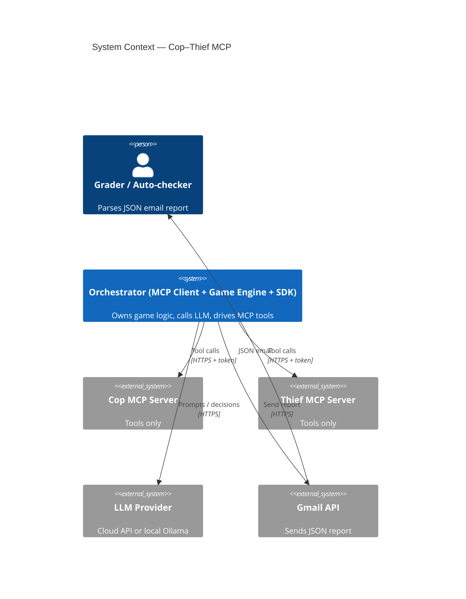
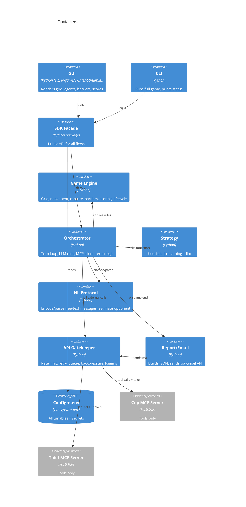
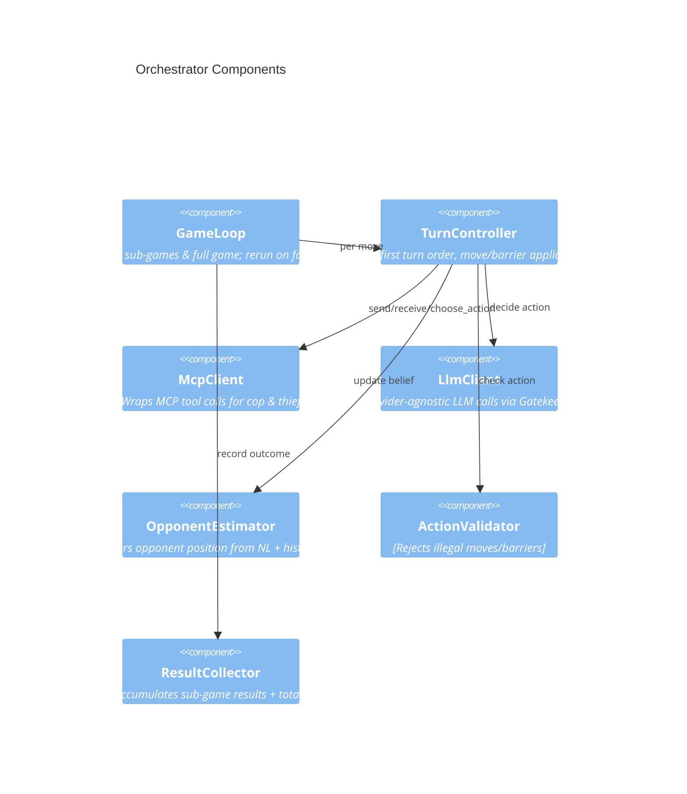
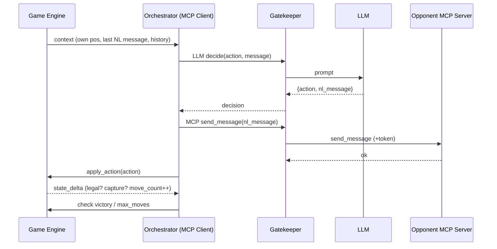
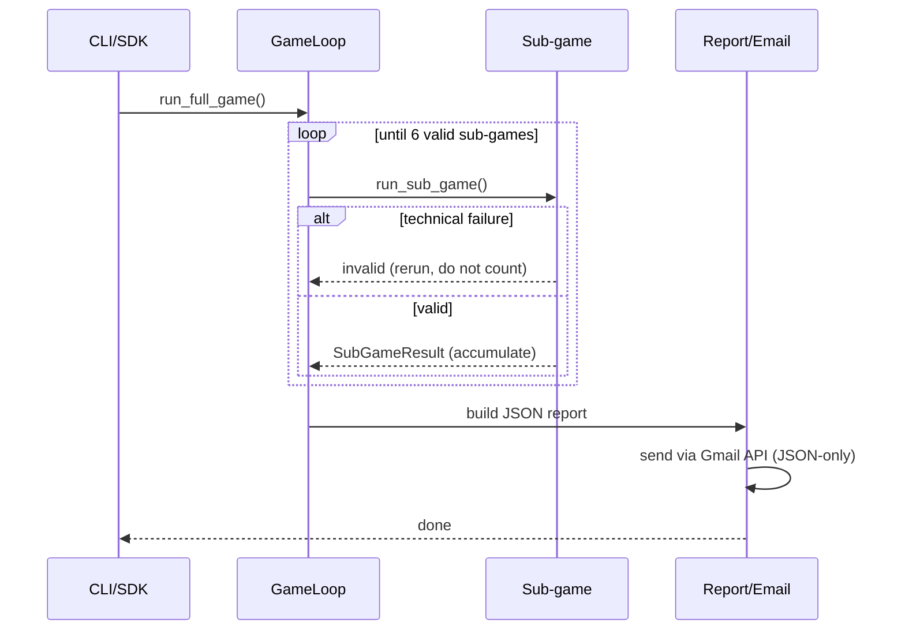
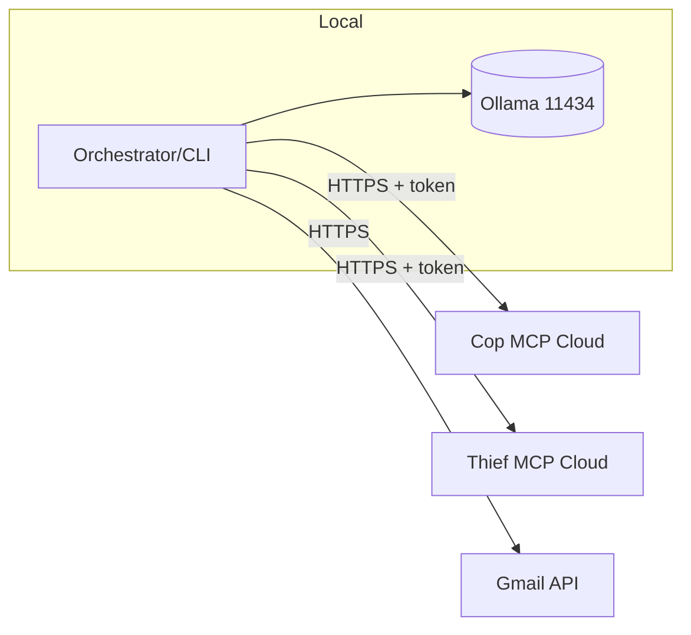

# PLAN — Architecture & Engineering Plan: Cop–Thief MCP System

| Field | Value |
|-------|-------|
| Document | Architecture / Engineering Plan |
| Project | `marl-cop-thief` |
| Version | 1.0 (draft) |
| Companion docs | `docs/PRD.md`, `docs/TODO.md`, `docs/PRD_game_engine.md`, `docs/PRD_qlearning.md`, `docs/PRD_nl_protocol.md` |
| Tooling | Python + `uv` only |

---

## 1. Architectural Principles

1. **SDK-first** — all business logic lives behind a single SDK facade. GUI, CLI, and any REST/email
   layer call the **SDK**, never internal services directly.
2. **MCP servers expose tools only** — the **LLM is never inside an MCP server**. The orchestrator
   (MCP client) hosts the LLM calls and game logic.
3. **Central API Gatekeeper** — every external call (LLM, MCP HTTP, Gmail) passes through one
   Gatekeeper handling rate limits, queues, retries, logging, monitoring, and backpressure. Limits
   come from config.
4. **Config over code** — no hard-coded board size, ports, URLs, timeouts, model names, or secrets.
5. **Single responsibility + small files** — each module ≤ ~150 LOC; split by responsibility.
6. **Security by default** — token auth on MCP servers; outbound-only client; secrets in env.

---

## 2. C4 — Level 1: System Context



---

## 3. C4 — Level 2: Containers



---

## 4. C4 — Level 3: Components (Orchestrator)



---

## 5. Repository / File Structure

```text
marl-cop-thief/
├── src/
│   └── cop_thief/
│       ├── __init__.py
│       ├── constants.py
│       ├── sdk/
│       │   ├── __init__.py
│       │   └── facade.py            # public API: run_full_game(), run_sub_game()
│       ├── services/
│       │   ├── engine/
│       │   │   ├── board.py         # grid, cells, bounds, barriers
│       │   │   ├── rules.py         # movement, capture, legality
│       │   │   ├── scoring.py       # per-sub-game + totals
│       │   │   └── lifecycle.py     # sub-game / full-game loop + rerun
│       │   ├── orchestrator/
│       │   │   ├── game_loop.py
│       │   │   ├── turn_controller.py
│       │   │   ├── mcp_client.py
│       │   │   ├── llm_client.py
│       │   │   ├── estimator.py
│       │   │   └── validator.py
│       │   ├── strategy/
│       │   │   ├── base.py          # Strategy interface
│       │   │   ├── heuristic.py     # Manhattan-distance baseline
│       │   │   ├── qlearning.py     # optional tabular Q-learning
│       │   │   └── llm_strategy.py  # prompt-based decisions
│       │   ├── nlp/
│       │   │   ├── encoder.py       # state -> natural-language message
│       │   │   └── parser.py        # message -> intent/estimate
│       │   └── report/
│       │       ├── builder.py       # build JSON contract
│       │       └── emailer.py       # Gmail API send (JSON-only body)
│       ├── mcp_servers/
│       │   ├── cop_server.py        # tools only
│       │   ├── thief_server.py      # tools only
│       │   └── tools.py             # shared tool implementations
│       ├── shared/
│       │   ├── config.py            # load + validate config
│       │   ├── gatekeeper.py        # rate limit/retry/queue/backpressure
│       │   ├── auth.py              # token issue/verify/revoke
│       │   ├── logging.py           # structured logging (no secrets)
│       │   └── version.py
│       ├── gui/
│       │   └── app.py               # calls SDK only
│       └── cli/
│           └── main.py              # calls SDK only
├── tests/{unit,integration}/
├── docs/{PRD.md,PLAN.md,TODO.md,PRD_game_engine.md,PRD_qlearning.md,PRD_nl_protocol.md}
├── config/{config.yaml, tokens.example.json}
├── data/  results/  assets/  notebooks/
├── README.md  pyproject.toml  uv.lock  .env-example  .gitignore
```

---

## 6. Component Responsibilities

| Component | Responsibility | Key boundaries |
|-----------|----------------|----------------|
| `sdk.facade` | Single public entry for GUI/CLI/REST | No rules logic; delegates to services |
| `engine.board` | Grid model, bounds, barrier storage | Pure; no I/O |
| `engine.rules` | Legality of moves, diagonal/orth, capture, crossing barriers | Pure; deterministic |
| `engine.scoring` | Apply scoring table; accumulate totals | Values from config |
| `engine.lifecycle` | Sub-game (≤25 moves) and full-game (6 valid) loops; rerun on tech failure | Owns validity rule |
| `orchestrator.*` | LLM calls, MCP tool calls, turn order, belief update, validation | MCP client lives here |
| `strategy.*` | Choose action given observation | Pluggable via config |
| `nlp.*` | Free-text encode/parse + opponent estimate | No raw-coord protocol |
| `mcp_servers.*` | Expose tools only (no LLM) | Stateless-ish; validated inputs |
| `shared.gatekeeper` | All external calls funnel here | Rate/retry/queue from config |
| `shared.auth` | Token issue/verify/revoke | Used by MCP servers |
| `report.*` | Build JSON + Gmail send | JSON-only body |
| `gui` / `cli` | Presentation only | Call SDK exclusively |

---

## 7. SDK Facade (public API)

```python
class CopThiefSDK:
    def __init__(self, config: Config) -> None: ...
    def run_sub_game(self, roles: Roles) -> SubGameResult: ...
    def run_full_game(self) -> FullGameReport: ...   # 6 valid sub-games + email
    def get_state(self) -> GameState: ...            # for GUI rendering
    def health_check(self) -> HealthStatus: ...      # MCP + LLM reachability
```

- GUI/CLI import only `CopThiefSDK`; they never touch `engine`, `orchestrator`, or `mcp_servers`.
- `run_full_game()` is the autonomous entry point used by `cli.main` (the "single command").

---

## 8. API Gatekeeper

All outbound calls (LLM, MCP HTTP, Gmail) go through `shared.gatekeeper`.
Local in-process MCP calls use the same Gatekeeper path with an `mcp-direct:*`
target label so rate limiting, retries, timeouts, and logging stay consistent
between development and HTTP/cloud runs.

```python
class Gatekeeper:
    def __init__(self, cfg: GatekeeperConfig) -> None: ...
    async def call(self, request: OutboundRequest) -> Response: ...
```

Responsibilities (all parameters from config):
- **Rate limiting** — token-bucket per target (`gatekeeper.rate_limit_per_target`).
- **Retries** — exponential backoff with jitter; max attempts from config.
- **Queue + backpressure** — bounded queue; reject/slow when saturated.
- **Timeouts** — per-call timeout from config.
- **Logging/monitoring** — structured records (latency, status); **never logs secrets/tokens**.

---

## 9. MCP Server Tool APIs

Two **independent** servers (`cop_server.py`, `thief_server.py`) expose **tools only**. Every tool
requires a valid auth token (verified by `shared.auth`). The LLM is **not** here.

| Tool | Input | Output | Notes |
|------|-------|--------|-------|
| `send_message` | `{from, text}` | `{ok, msg_id}` | Free-text NL message; stored for the opponent |
| `receive_message` | `{for_agent}` | `{text, msg_id}` | Latest NL message addressed to the agent |
| `update_position` | `{agent, pos}` | `{ok, pos}` | Engine-authoritative position write/verify |
| `verify_position` | `{agent}` | `{pos}` | Returns the agent's own known position |
| `choose_action` | `{agent, observation}` | `{action}` | Contract/helper tool; autonomous orchestrator strategies usually decide client-side |
| `apply_action` | `{agent, action}` | `{state_delta, legal}` | Bridges to engine; rejects illegal actions |
| `game_status` | `{}` | `{cop_pos, thief_pos, barriers, barriers_used, move_count, scores, over, winner}` | Engine snapshot for orchestration |

- **Action vocabulary:** `up, down, left, right, up_left, up_right, down_left, down_right, stay,
  place_barrier` (cop only for `place_barrier`).
- Tools **validate inputs** (bounds, turn ownership, barrier limit) and return structured errors.
- Tools are thin: heavy game logic stays in `engine` via the orchestrator; servers only mediate.
- The LLM and strategy implementations never run inside MCP servers. The
  orchestrator chooses actions, validates them, and calls `apply_action`.

---

## 10. Data Schemas

### 10.1 Config (see PRD §11 for full key list)
```yaml
grid_size: [5, 5]
max_moves: 25
num_games: 6
max_barriers: 5
scoring: { cop_win: 20, thief_win: 10, cop_loss: 5, thief_loss: 5 }
start_mode: random
thief_moves_first: true
discount_gamma: 0.95
strategy: heuristic            # heuristic | qlearning | llm
llm: { provider: openai, model: gpt-4o-mini, timeout_s: 30 }
mcp:
  mode: direct                 # direct | http | auto
  auto_launch: true            # used when mode=http and URLs are localhost
  cop_url: "http://localhost:8001"
  thief_url: "http://localhost:8002"
gatekeeper: { rate_limit_per_target: 5, max_retries: 3, queue_size: 64, timeout_s: 30 }
email: { to: "rmisegal+uoh26b@gmail.com" }
timezone: "Asia/Jerusalem"
seed: null
```

### 10.2 NL Message
```json
{ "msg_id": "uuid", "from": "thief", "to": "cop", "text": "I'm hugging the eastern wall, far from you.", "ts": "ISO-8601" }
```

### 10.3 Game State
```json
{ "cop": [r,c], "thief": [r,c], "barriers": [[r,c]], "move_count": 0,
  "barriers_used": 0, "over": false, "winner": null }
```

### 10.4 Sub-game Result
```json
{ "index": 1, "cop_role_group": "A", "winner": "cop", "moves": 12,
  "barriers_used": 3, "scores": { "cop": 20, "thief": 5 } }
```

### 10.5 Final Report — see PRD §12 (JSON-only email body).

---

## 11. Sequence — One Turn (NL + MCP + LLM)



---

## 12. Sequence — Full Game (6 valid sub-games + email)



---

## 13. LLM Integration & Prompt Design

- **Provider-agnostic `LlmClient`** behind the Gatekeeper. Provider/model/timeout from config; keys
  from env. Supported: OpenAI / Anthropic / Gemini (Option 1) and Ollama `localhost:11434` (Option 3).
- **Prompt structure per turn:** system role (cop or thief, rules summary, board size, barrier budget)
  + observation (own position, move count, score) + last NL message from opponent + required output
  schema `{action, nl_message}`.
- **Output contract:** LLM returns a JSON object; orchestrator validates `action` against the legal
  vocabulary and falls back to the heuristic strategy if parsing/legality fails.
- **Security:** in hybrid mode the client makes **outbound HTTPS only**; Ollama is **never** exposed.

---

## 14. Decision Strategy

| Strategy | Mechanism | When |
|----------|-----------|------|
| `heuristic` | Manhattan distance: cop minimizes, thief maximizes; barrier when adjacent & budget left | Default baseline / fallback |
| `qlearning` | Tabular `Q(s,a)`, Bellman update `Q←Q+α[r+γ·maxQ(s',a')−Q]` | Optional; detailed in `PRD_qlearning.md` |
| `llm` | Prompt-based action + NL message | NL-rich play |

- `OpponentEstimator` maintains a belief over opponent position from NL messages + move history
  (partial observability), feeding both heuristic and Q-learning state encodings.

---

## 15. Deployment

### 15.1 Stage 1 — Local
- Cop MCP server → `localhost:8001`; Thief MCP server → `localhost:8002` (ports from config).
- Orchestrator/CLI runs locally; verify full pipeline and inter-agent NL communication end-to-end.

### 15.2 Stage 2 — Cloud
- Deploy both MCP servers to a public platform (e.g., **Prefect Cloud** or similar) → two public URLs
  `cop_mcp_url`, `thief_mcp_url`.
- Recommended **Hybrid (Option 3)**: LLM/Ollama + client local; MCP servers in cloud; client makes
  outbound HTTPS only — local machine is never exposed.



---

## 16. Security Design

- **Token auth** (`shared.auth`): every MCP tool call carries a bearer token; servers verify before
  executing. Tokens stored hashed; plaintext only in env at issue time.
- **Revocation:** a token blocklist (config/store) allows immediate revoke/rotate (NFR-2).
- **No local exposure:** Ollama port 11434 is never published; only outbound client traffic.
- **Secrets:** LLM keys, MCP tokens, Gmail OAuth creds in `.env` / env vars; `.env` git-ignored;
  `.env-example` documents required names. Secrets never logged (Gatekeeper redaction).
- **Input validation:** all MCP tool inputs and config values validated; illegal actions rejected.

---

## 17. Testing Strategy

- **TDD** (Red→Green→Refactor) for engine and scoring (pure, deterministic with `seed`).
- **Unit tests:** board bounds, diagonal/orth moves, barrier crossing/limit, capture, scoring table,
  max-moves termination, config loading/validation, NL parser, estimator, Gatekeeper retry/limit.
- **Integration tests:** orchestrator turn loop with **mocked** MCP servers + **mocked** LLM; full
  6-valid-sub-game loop including a forced technical-failure rerun; report JSON schema validation;
  email send mocked.
- **Mocks:** all external calls (LLM, MCP HTTP, Gmail) mocked; no network in CI.
- **Quality gates:** **≥ 85%** coverage; **Ruff 0** violations via `uv run ruff check .`.

---

## 18. Architecture Decision Records (ADRs)

| ADR | Decision | Rationale | Alternatives |
|-----|----------|-----------|--------------|
| ADR-1 | LLM in orchestrator, not MCP server | Assignment rule; keeps servers as pure tools | LLM inside server (rejected) |
| ADR-2 | SDK facade as sole entry point | Decouples GUI/CLI from logic; testable | Direct service calls (rejected) |
| ADR-3 | Central Gatekeeper for all egress | Uniform rate/retry/security | Per-call ad-hoc handling (rejected) |
| ADR-4 | Hybrid deployment (Option 3) default | Avoids exposing local machine/Ollama | Expose Ollama (insecure, rejected) |
| ADR-5 | Heuristic baseline mandatory, Q-learning optional | Guarantees a working agent; RL not required | RL-only (risky, rejected) |
| ADR-6 | NL message + JSON action output from LLM | Satisfies NL requirement while staying parseable | Raw-coord protocol (forbidden) |
| ADR-7 | Config in YAML, secrets in env | Readable config; secure secrets | Secrets in config (rejected) |

---

## 19. Trade-offs

- **NL communication vs reliability:** free text adds ambiguity; mitigated by validation + heuristic
  fallback (correctness preserved even when the LLM is vague).
- **Cloud MCP vs latency:** remote tool calls add latency; Gatekeeper queue/backpressure absorbs it.
- **Q-learning vs effort:** richer behavior but training cost; kept optional behind config.

---

## 20. Phased Implementation Roadmap & Definition of Done

Maps to PRD §15. Each phase: implement → test → Ruff → docs update.

| Phase | Deliverables | Definition of Done |
|-------|--------------|--------------------|
| **P0** Scaffold | `uv` project, structure, `config.py`, `gatekeeper.py`, `.env-example` | `uv sync` works; config loads/validates; Ruff clean |
| **P1** Engine | board, rules, scoring, lifecycle | Unit tests pass; deterministic with seed; ≥85% on engine |
| **P2** MCP servers | cop/thief servers + tools + auth | Tools callable locally with token; unauth rejected |
| **P3** Orchestrator | game loop, turn controller, MCP client, validator | 6 sub-games run locally via MCP, 0 manual steps |
| **P4** Strategy | heuristic (+ optional Q-learning) | Strategy selectable via config; baseline completes games |
| **P5** NL layer | encoder, parser, estimator | Turns use free-text; ambiguity handled; logs show NL |
| **P6** GUI | grid/agents/barriers/scores via SDK | Visual run matches engine state |
| **P7** Cloud + auth | deploy servers; public URLs; token revoke | `cop_mcp_url`/`thief_mcp_url` live; revoke verified |
| **P8** Report | JSON builder + Gmail emailer | JSON-only email delivered after 6 valid sub-games |
| **P9** Hardening | tests ≥85%, README (Dec-POMDP + evidence), audit | All PRD acceptance criteria green; final checklist |

---

## 21. Open Technical Decisions

- GUI framework: Pygame vs Tkinter vs Streamlit (all SDK-only consumers).
- MCP framework/runtime and the exact cloud platform (Prefect Cloud vs alternative).
- Gmail auth: OAuth user flow vs service account vs app-password fallback.
- Q-learning inclusion and training/persistence format (if pursued).
